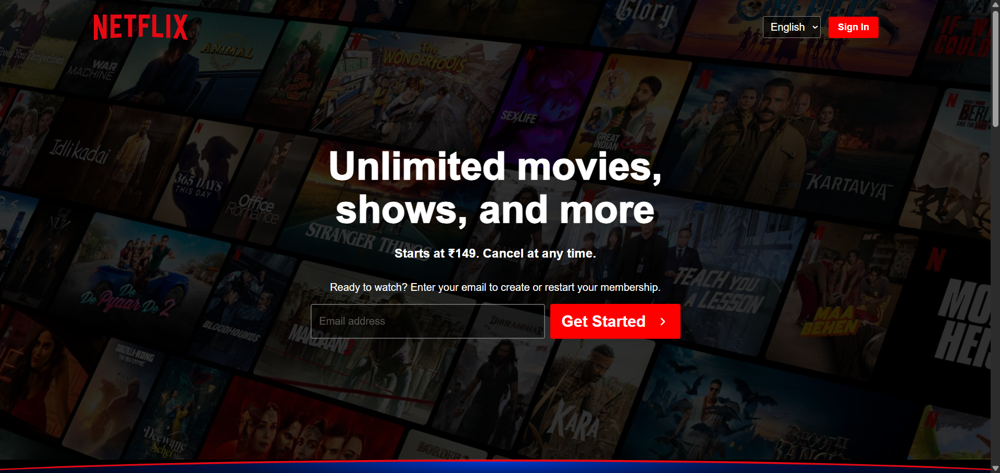
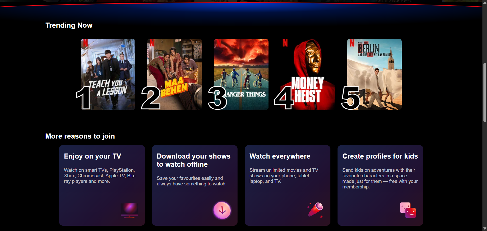
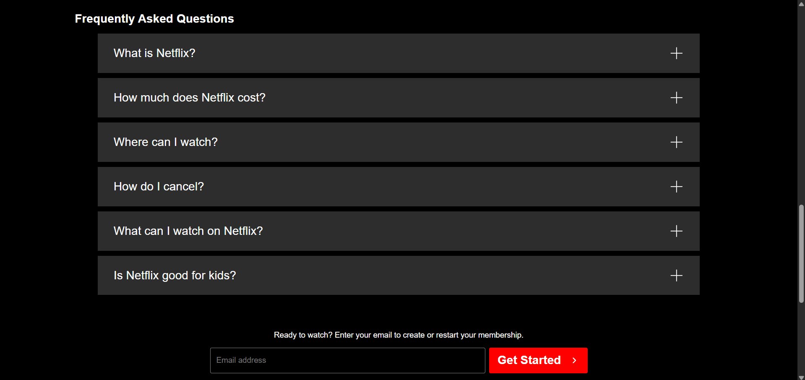
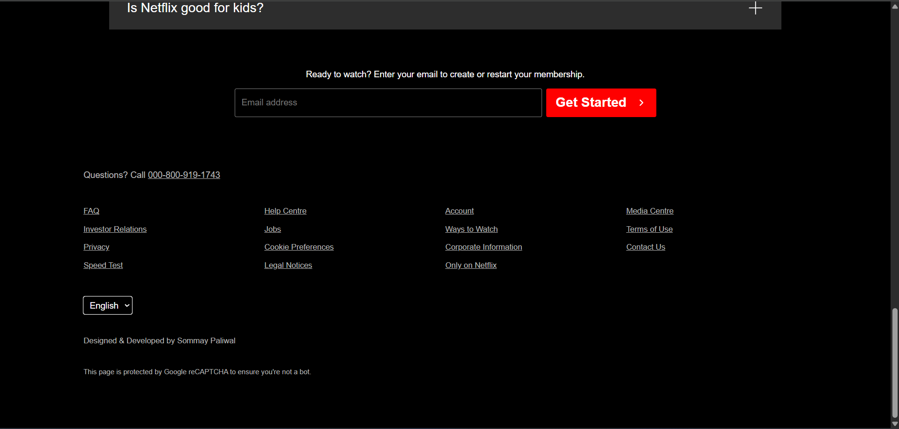

# Netflix Clone

A responsive Netflix landing page clone built using HTML and CSS.

## Features

- Responsive design
- Netflix-inspired UI
- Hero section with background overlay
- Trending Now section
- More Reasons to Join section
- FAQ section
- Footer section
- Mobile responsive layout

## Technologies Used

- HTML5
- CSS3

## Project Structure

```
Netflix Clone/
│
├── assets/
├── screenshots/
├── index.html
├── style.css
└── README.md
```

## Screenshots

### Homepage



### Trending & Features



### FAQ Section



### Footer



## Author

Designed & Developed by **Sommay Paliwal**